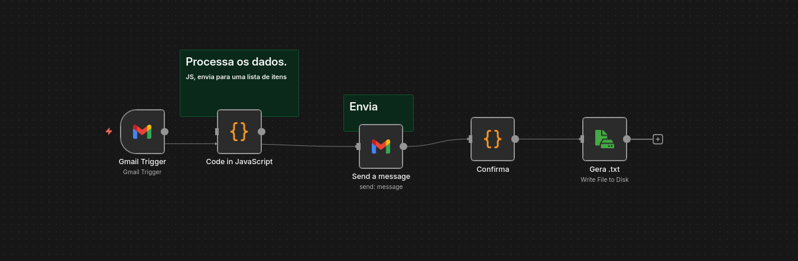

# n8n Gmail Automation Workflow


This repository contains an n8n workflow that receives emails through Gmail, processes the content, forwards messages to multiple recipients, and generates persistent `.txt` logs on disk.

## Features

- Gmail Trigger to capture incoming emails
- Java Code node to extract and format subject/body
- Email dispatch to multiple recipients
- Status tracking (OK / error)
- Log generation using Write File to Disk
- Folder mounted via Docker for persistent storage

## Workflow Structure

1. **Gmail Trigger**  
   Captures new incoming emails.

2. **Code (Java)**  
   Formats subject, body, and prepares structured data.

3. **Gmail Send Email**  
   Sends messages to multiple recipients.

4. **Code (Log Builder)**  
   Generates log text with timestamp and email metadata.

5. **Write File to Disk**  
   Writes a `.txt` log file to the `/logs` directory.

## Docker Setup

Example `docker run`:

```bash
docker run -d --name n8n \
  -p 5678:5678 \
  -v /home/node/.n8n:/home/node/.n8n \
  -v /home/node/n8n-logs:/logs \
  n8nio/n8n
